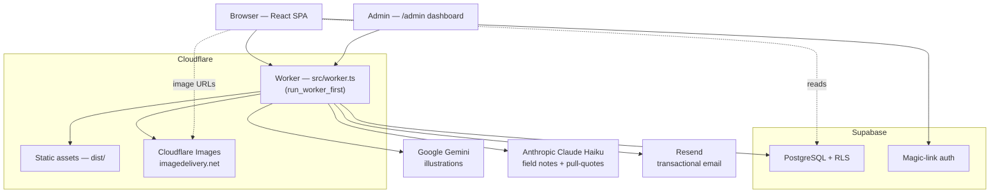
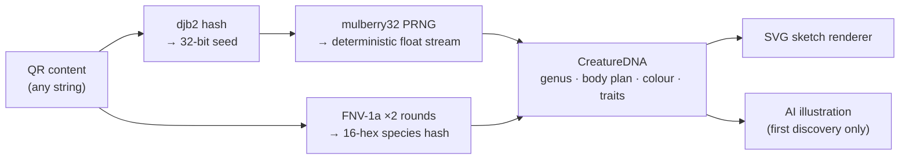
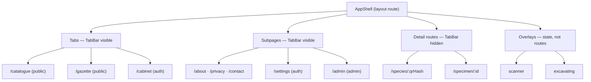
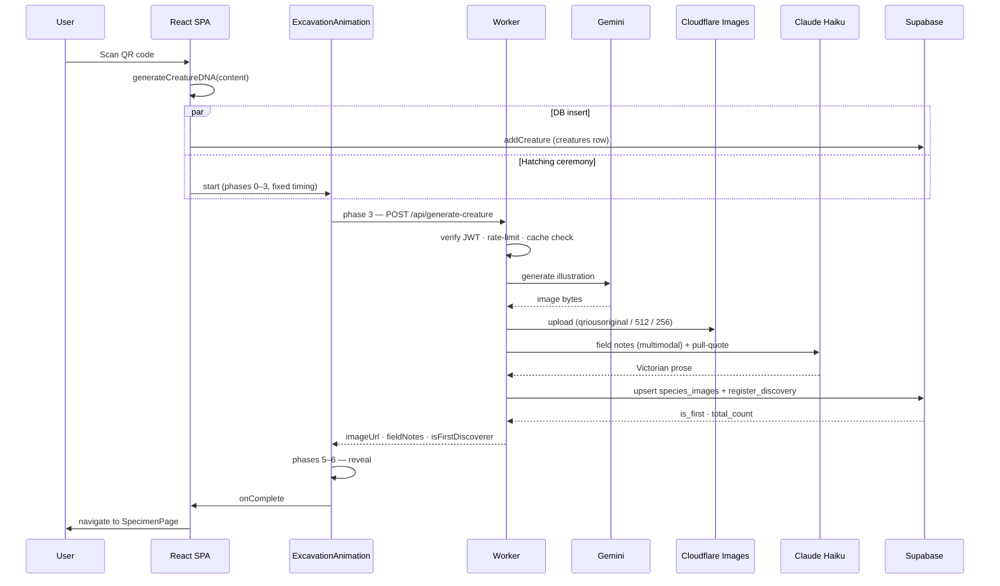
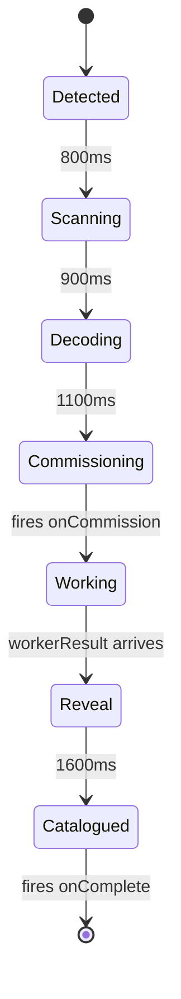

# Architecture

*QRious Specimens — every QR code is a fossil waiting to be found.*

This document explains how QRious Specimens is built and, more importantly, *why* it is built the way it is. It is the companion to the [README](./README.md): the README tells you what the app does, this tells you how the pieces fit and which constraints shaped them.

---

## Why this architecture

Four constraints shaped almost every decision.

**A creature must be a pure function of its QR code.** The same QR code, scanned by anyone, anywhere, at any time, must always yield the same creature — its taxonomy, anatomy, colouring, and temperament. This is the product's central promise. It means the creature-generation logic cannot live on a server that might drift, cache, or version; it has to be a deterministic, client-side computation over the QR string. Everything downstream (illustration, field notes, catalogue) hangs off the 16-character hash that this computation produces.

**The expensive, non-deterministic work happens once per species, not once per scan.** The AI illustration (Gemini) and the field notes (Claude) are slow and costly, and there is no reason to redo them — the creature is identical for every discoverer. So the first person to scan a given code commissions the artwork; everyone after them reads it from cache. The architecture is built around a single write path guarded by the species hash.

**The public can browse; only naturalists can collect.** The Catalogue and the Gazette are open to anyone, no account required — they are the shop window. Scanning, the personal Cabinet, and anything that writes data require a signed-in naturalist. The auth boundary therefore sits at the *destination*, not at the front door.

**Privacy is structural, not procedural.** Explorers appear in the public Gazette under auto-generated Victorian names, never their real ones — and that is enforced by the code paths that write names, not by a policy we promise to follow. Personal email addresses, raw scan content, and account identities never reach a public surface. Where the easy implementation would have leaked something, we chose the harder one.

These produce four design principles you will see repeated below: **determinism at the edge of the client**, **cache-by-species not cache-by-scan**, **auth at the destination**, and **privacy enforced in the write path**.

---

## System overview

QRious Specimens is a single-page React app served by one Cloudflare Worker, talking to Supabase for data and auth and to three AI/email services for the expensive bits. There is no traditional backend server — the Worker *is* the backend, and it does only what genuinely cannot happen in the browser.



The browser reads public data (Catalogue, Gazette) directly from Supabase through Row Level Security — no Worker hop needed, because RLS already enforces what an anonymous visitor may see. The Worker is reserved for the three things the browser must *not* do itself: hold AI/service credentials, write privileged rows, and own the security headers.

**`run_worker_first` is load-bearing.** The Worker runs ahead of static-asset serving for *every* request, including `index.html`, JS, and CSS. Without it, matched assets would be served straight from the edge and bypass the Worker — which means the documents the browser actually fetches would arrive with no Content-Security-Policy. Routing everything through the Worker lets `withSecurityHeaders()` apply one policy in one place. See [security-headers.md](./REFERENCE/security-headers.md).

---

## The DNA engine

This is the heart of the app, and the one piece worth understanding before anything else. `src/lib/creatureEngine.ts` turns any string into a complete creature, deterministically, entirely in the browser.



The QR string is run through two independent hashes. **djb2** produces a 32-bit seed for the PRNG; a **two-round FNV-1a** produces the 16-hex-character *species hash* (`dna.hash`, stored as `qr_hash` in the database). The seed feeds **mulberry32**, a small, fast, high-quality seedable PRNG, which emits a deterministic stream of floats. Every field of `CreatureDNA` — symmetry, body shape, limb count and style, eye placement, HSL palette, genus and species names, order, family, habitat, temperament — is derived by drawing from that stream in a fixed order.

Because the order is fixed and the PRNG is seeded, **the same input always produces exactly the same DNA**. The double FNV-1a hash makes species-level collisions vanishingly unlikely. And it all runs client-side, before any database write — the server never decides what a creature is.

`CreatureDNA` then drives two renderers. The **SVG sketch** (`CreatureRendererSketch`) is a pure function `(DNA) → SVG`, drawing a Victorian ink-on-parchment illustration with superformula body shapes, Catmull-Rom spline limbs, and stippled surface patterns. It needs no network and renders instantly, so it powers cabinet thumbnails and teaser cards, and serves as the fallback whenever an AI illustration does not (yet) exist. The **AI illustration** is the showpiece, commissioned once per species — covered next.

---

## The frontend

A Vite + React 18 + TypeScript SPA, styled with Tailwind and shadcn/ui (Radix primitives). Routing is React Router; the app is wrapped in a single `AppShell` layout route that owns the chrome — the journal-spine margin strip, the footer, and the tab bar — and renders the active page into an `<Outlet>`.



**Auth lives at the destination, not the shell.** `AppShell` stays mounted whether or not you are signed in. Catalogue and Gazette render for everyone; `/cabinet`, `/settings`, and the scan flow are guarded by a path-prefix check that redirects unauthenticated visitors to `/enter`. Because the shell never unmounts, the route a visitor was reaching for survives the sign-in round-trip.

**Overlays are state, not routes.** The two full-screen, no-tab-bar moments — the QR `scanner` and the `excavating` hatching ceremony — are held as `useState` inside `AppShell` rather than as routes. This is deliberate: they are transient ceremonies tied to a precise animation lifecycle, not destinations you would bookmark or navigate back to. Detail routes (`/species/:qrHash`, `/specimen/:id`) *are* real routes, and simply hide the tab bar by path prefix.

> **Historical note for maintainers:** the app originally used a hand-rolled `{ tab, overlay, subpage }` state model with *no* URL router (ADR [`2026-04-09-layered-navigation-model`](./REFERENCE/decisions/2026-04-09-layered-navigation-model.md)), then migrated to React Router three days later once the public Catalogue, Gazette, and species pages needed shareable URLs. The auth-at-the-destination principle and the full-screen overlays survived the migration; the in-memory state model did not. See ADR [`2026-04-12-url-routing-react-router`](./REFERENCE/decisions/2026-04-12-url-routing-react-router.md).

Data fetching is **TanStack Query** throughout. Public reads (`useCatalogue`, `useCommunityFeed`, `useExplorerShowcase`) hit Supabase RPCs directly with per-query stale times; the Gazette feed polls every 30s, the showcase every 60s. Personal reads (`useCreatures`) use `useInfiniteQuery` with cursor pagination.

---

## The discovery pipeline

This is where the four constraints meet. A scan kicks off two things at once — a database insert and a cinematic animation — and the slow AI work is folded into the time the animation buys.



**Why insert and animate in parallel.** The hatching animation runs for roughly five seconds regardless; a warm Supabase insert takes 200–800ms. Running them concurrently means the database result is almost always ready well before the curtain rises, so the ceremony never feels like a loading spinner. A small `animationDoneRef` flag handles the rare slow-network case where the animation finishes first — it simply waits for the insert to settle before navigating.

**Why the Worker is the only writer of `species_images`.** The illustration and field notes are commissioned exactly once per species. The Worker checks the `species_images` cache first; on a hit it skips Gemini and Claude entirely and returns the stored result. On a miss it generates the image, uploads it to Cloudflare Images (one POST; the CDN serves three named variants), writes the field notes and a pull-quote via Claude Haiku, and upserts the row with `ON CONFLICT (qr_hash) DO NOTHING` so two concurrent first-discoverers cannot collide.

**Why first-discoverer status is server-authoritative.** After the image write, the Worker calls the `register_discovery` RPC, which atomically increments the discovery count and — if this caller is genuinely the first — stamps `is_first_discoverer = true` onto their `creatures` row. Doing this server-side means the badge survives a page reload; doing it any other way would let a client spoof it. `EXECUTE` on that RPC is restricted to the service role, so no browser can call it directly and force the flag onto someone else's specimen.

Steps that are *non-fatal*: if Gemini fails, the sketch stays on screen through the reveal and there is no blank viewport. If Claude or the database write fails, the discovery still completes — the naturalist just sees a graceful "the specimen eluded our naturalist" notice rather than an error wall.

### The excavation animation

The ceremony itself is a seven-phase state machine. Phases 0–3 run on fixed timing; phase 3 fires the Worker call; phase 4 is open-ended and waits for the Worker result before the reveal in phases 5–6.



Two independent `requestAnimationFrame` loops drive it: one runs phases 0–3 and stops at the open-ended "artist at work" phase; the second starts only when the Worker result arrives and runs the reveal through to completion. This decoupling is what lets the fixed-timing front half and the network-dependent back half coexist without either blocking the other.

---

## The backend

One Worker, one router. `src/worker.ts` matches three API paths and hands everything else to the static-asset binding (which serves `index.html` for unknown paths so React Router can take over client-side).

| Surface | Route | Reference |
|---|---|---|
| Discovery | `POST /api/generate-creature` | [ai-generation-worker.md](./REFERENCE/ai-generation-worker.md) |
| Contact form | `POST /api/contact` | Resend admin notification |
| Account erasure | `POST /api/admin-delete-user` | [ADR 2026-05-04](./REFERENCE/decisions/2026-05-04-worker-mediated-account-erasure.md) |

Every response — API and static asset alike — is wrapped by `withSecurityHeaders()`. The wrapper has a deliberate fallback: because `run_worker_first` routes *all* traffic through this handler, an unhandled throw would otherwise blank the entire site, so a failure degrades to "this one response is missing its security headers" rather than "the site is down".

**Rate limiting sits at the cheapest checkpoint that still has the key it needs.** Discovery is guarded by two limiters: a per-user limiter keyed on the verified JWT `sub` (5/min — fires the moment `sub` exists), and a global backstop keyed on a constant (100/min) to blunt Sybil amplification where an attacker spreads load across many accounts. The contact form is limited per IP before any database write; admin erasure is limited per admin caller. All are declared as `[[unsafe.bindings]]` in [`wrangler.toml`](./wrangler.toml) and shared through `workers/shared/rateLimit.ts`.

**Auth verification is shared and JWKS-based.** `workers/shared/jwt.ts` verifies Supabase ES256/RS256 tokens against the project JWKS, with a per-isolate cache, automatic refetch on key rotation, and an HS256 fallback for legacy projects. Both the discovery and erasure Workers use it. See [ADR 2026-04-20](./REFERENCE/decisions/2026-04-20-jwks-jwt-verification.md).

---

## Data and privacy

Supabase is used for PostgreSQL, Row Level Security, and magic-link auth only — no Supabase Storage (images go to Cloudflare Images) and no Edge Functions (AI calls go to the Worker). The schema is small:

```
creatures              one row per user per discovery; holds qr_content, qr_hash,
                       the full CreatureDNA jsonb, nickname, is_first_discoverer
species_images         one row per species (qr_hash); image URLs, field_notes,
                       pull_quote, first_discoverer_id, discovery counters
species_discoveries    authoritative per-species discovery count
explorer_profiles      opt-in Gazette identity; is_public gates feed visibility
explorer_badges        earned badges per user, with per-badge public toggle
activity_feed          append-only public log of discoveries, badges, tier changes
```

The Catalogue joins `species_images` to taxonomy with a lateral join into `creatures.dna` (matched on `dna->>'hash' = qr_hash`), because the media row stores no taxonomy of its own. RLS does the access control: public profiles' activity is world-readable; private profiles produce no rows, so their data is suppressed at the database layer, not hidden by the UI.

### What is deliberately absent

The privacy posture is defined as much by what the system *cannot* expose as by what it does.

- **No real names in public.** Explorers in the Gazette appear only as auto-generated Victorian names (`"Dr. E. Blackwood"`, `"Captain R. Huxley"`). The name generator is the *only* client-side path that writes a display name — there is no field where a user could type their real one. The privacy promise is enforced by the write path, not a policy. (There is a roughly 1-in-2000 Easter egg: `"A. Anning"`, a nod to Mary Anning.)
- **No raw scan content on any public surface.** The QR string lives in the owner's `creatures` row, RLS-scoped to them. The public sees only the derived species hash and the creature.
- **No rarity snapshots.** A specimen's tier (Extraordinary / Notable / Common) is derived *live* from the current discovery count everywhere it renders — there is no `rarity_at_discovery` column. The cabinet is a window onto the world as it is now, not a museum of past states. See [ADR 2026-05-12](./REFERENCE/decisions/2026-05-12-tier-change-events.md).
- **No self-service deletion footgun, but full erasure on request.** Account erasure is an admin-gated Worker route that deletes both app data and the Supabase Auth row, and is honest about its non-atomicity — partial failure surfaces in the response rather than being papered over. Contact messages are retained on erasure for the legal basis in GDPR Art. 17(3). See ADRs [2026-05-04](./REFERENCE/decisions/2026-05-04-worker-mediated-account-erasure.md) and [2026-04-19](./REFERENCE/decisions/2026-04-19-retain-contact-messages-on-gdpr-delete.md).

---

## Key architectural decisions

The full log lives in [`REFERENCE/decisions/`](./REFERENCE/decisions/). The ones that shaped the structure above:

| Decision | In one line |
|---|---|
| [Security response headers](./REFERENCE/decisions/2026-05-29-security-response-headers.md) | One Worker-wide wrapper applies CSP + hardening to every response; `run_worker_first` makes it inescapable. |
| [Live-derived rarity + tier-change events](./REFERENCE/decisions/2026-05-12-tier-change-events.md) | Rarity is computed live, never snapshotted; threshold crossings post their own Gazette notice. |
| [Pull-quote generation](./REFERENCE/decisions/2026-05-10-pull-quote-generation.md) | A second text-only Haiku call per species, soft-fail, sharing the production function with its variety test. |
| [Worker-mediated account erasure](./REFERENCE/decisions/2026-05-04-worker-mediated-account-erasure.md) | GDPR Art. 17 erasure behind a JWT + admin gate; honest about non-atomic failure. |
| [Cloudflare Images over R2](./REFERENCE/decisions/2026-04-20-cloudflare-images-over-r2.md) | One upload, three CDN-served variants; R2 retired. |
| [JWKS JWT verification](./REFERENCE/decisions/2026-04-20-jwks-jwt-verification.md) | Verify Supabase ES256/RS256 via JWKS with per-isolate cache; HS256 kept for legacy. |
| [URL-based routing with React Router](./REFERENCE/decisions/2026-04-12-url-routing-react-router.md) | Every page gets a bookmarkable, shareable URL; scanner + excavation stay as overlays. Supersedes the 2026-04-09 layered navigation model. |

---

## Deployment

Deployment is automatic on push to `main`. `.github/workflows/deploy.yml` runs the test suite, builds the SPA, and runs `wrangler deploy` via the Cloudflare action — there is no manual deploy step in the normal flow.

One ordering rule matters: **migrations land before the code that depends on them.** When a change includes new files under `supabase/migrations/`, each is applied to Supabase production by hand *before* the PR merges, because the Worker and frontend deploy the moment it lands — and a deployed RPC whose signature has not yet been migrated will soft-degrade or 500. The migration file is the source of truth.

Secrets (`GEMINI_API_KEY`, `ANTHROPIC_API_KEY`, `SUPABASE_SERVICE_ROLE_KEY`, `RESEND_API_KEY`, the Cloudflare Images token, and the rest) are set via `wrangler secret put` and never committed. Full configuration: [REFERENCE/environment-setup.md](./REFERENCE/environment-setup.md).
